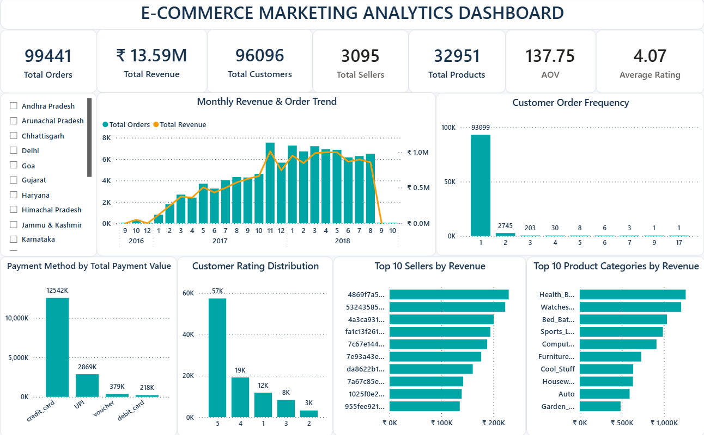

# E-Commerce Marketing Analytics

## Project Overview

An end-to-end e-commerce analytics project focused on understanding sales performance, customer behavior, product and seller performance, payment behavior, and customer satisfaction.

The project covers the complete analytics workflow from data audit and validation to data cleaning, exploratory analysis, SQL analysis, Power BI dashboarding, and business recommendations.

---

## Business Objectives

- Measure overall e-commerce performance.
- Analyze order and revenue trends.
- Understand customer acquisition and repeat-purchase behavior.
- Identify high-performing product categories.
- Analyze seller and payment performance.
- Evaluate customer satisfaction through ratings.

---

## Tools Used

- SQL Server
- Power BI
---

## Key Metrics

| Metric | Value |
|---|---:|
| Total Orders | 99,441 |
| Unique Customers | 96,096 |
| Product Revenue | ₹13.59M |
| Average Order Value | ₹137.75 |
| Total Sellers | 3,095 |
| Total Products | 32,951 |
| Average Rating | 4.07 / 5 |
| Repeat Customer Rate | 3.12% |

---

## Project Workflow

**Data Audit → Data Validation → Data Cleaning → EDA → Power BI → Insights & Recommendations**

---

## Power BI Dashboard

The Power BI dashboard contains pages:

### 1. Executive Overview

Provides a high-level view of:

- Business KPIs
- Monthly revenue and order trends
- Customer order frequency
- Product category performance
- Seller performance
- Payment behavior
- Customer ratings

> The `.pbix` file is not included in the repository due to file-size limitations.

---

## Key Business Insights & Recommendations

| Insight | Recommendation |
|---|---|
| Repeat Customer Rate is only 3.12% | Focus on personalized retention campaigns and repeat-purchase initiatives |
| Top 5 product categories contribute approximately 39.7% of category revenue | Prioritize inventory, marketing, and cross-selling in high-performing categories |
| Credit cards contribute approximately 78.3% of total payment value | Maintain a smooth card-payment experience and encourage UPI adoption |
| Average customer rating is 4.07/5, with 15.1% of reviews rated 1–2 stars | Investigate key drivers of low ratings across delivery, product, and seller experience |
| Revenue is distributed across multiple sellers | Monitor top-performing sellers and extend successful practices across the seller base |

---

## Data Cleaning

Raw data was preserved and cleaned in SQL Server using a separate `CLEAN` schema.

Key steps included datatype conversion, text standardization, date handling, missing-value checks, and data-quality validation.

---
│   ├── Data_Cleaning.md
│   └── Data_Dictionary.md
│
└── README.md
